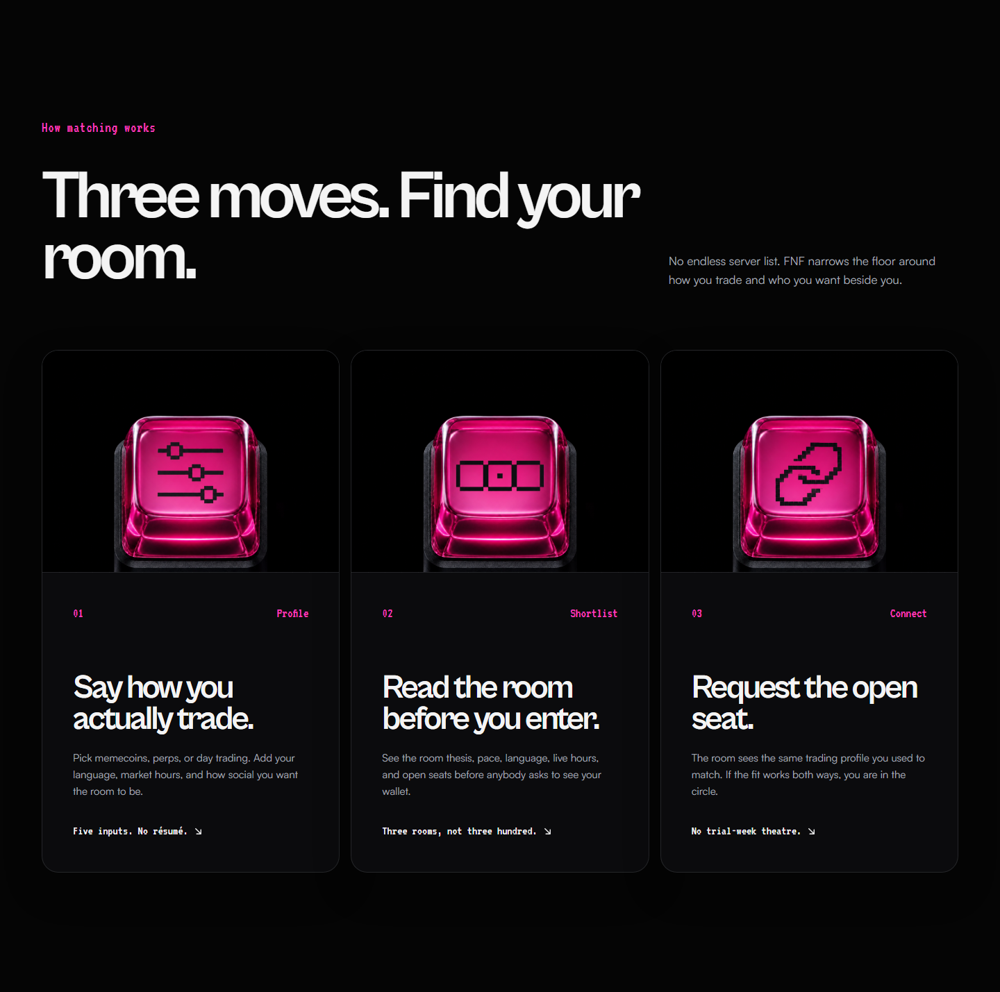

# FNF

Friends, not followers. FNF is a frontend MVP for finding small private trading rooms around trading style, language, market hours, and room culture.



## What is included

- Full-screen retro-futurist landing experience
- Searchable and filterable crew floor
- Matching flow for memecoins, perps, and day trading
- Worldwide room discovery by language and market hours
- Clan performance showcase
- Public trader proof cards for Rasmr, Orangie, and Requisiem
- Create-room and room-detail interactions
- Mechanical keyboard-inspired buttons with optional click audio
- Responsive desktop and mobile layouts
- Reduced-motion support

## Run locally

```bash
npm install
npm run dev
```

Vite serves the project at `http://localhost:5173` by default.

Build and preview the production bundle:

```bash
npm run build
npm run preview
```

## Architecture

The project is a client-side React application built with Vite. UI state and mock crew data live locally; there is currently no backend or wallet transaction layer.

- React 19 for component and interaction state
- Motion and GSAP for restrained entrance and scroll animation
- Tailwind CSS plus a project-specific CSS system
- Phosphor icons
- Self-hosted typefaces and local visual assets
- Web Audio API synthesis for the mechanical click feedback

## Project structure

```text
src/
  components/   Interface sections and overlays
  hooks/        Shared interaction behavior
  data.js       Mock crews and local asset references
  index.css     Brand, layout, responsive, and motion system
public/
  assets/       Runtime imagery and video
  fonts/        Self-hosted typography
docs/
  fnf-preview.png
```

## Notes

- All trading information is mock frontend content.
- FNF does not provide financial advice or validate tokens.
- External trader proof links open their original public source.
- The visual direction uses original FNF-generated keycap artwork and user-supplied clan media.
